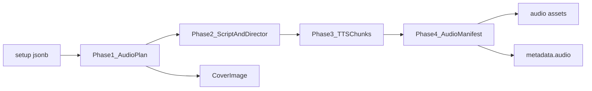

# Podcast and Audiobook Audio Generation Rules

Rules for AI-generated **podcast** and **audiobook** content in the Chrysty Creative Library. Both categories are **audio-primary**: the backend plans duration, chooses voices, designs performance with audio tags, and produces TTS output like a real episode or chapter.

Related docs:

- [content-metadata-schema.md](./content-metadata-schema.md) — Audio Manifest and metadata
- [gemini-text-to-speech.md](./gemini-text-to-speech.md) — TTS API reference
- [content-generation-plan.md](./content-generation-plan.md) — overall pipeline

## Pipeline overview



The text model plans first, then writes the tagged script and director brief in one step. TTS executes from structured **audio direction**, not raw wizard dropdowns. The tagged script is used only during TTS synthesis and is **not** stored in the Audio Manifest or viewer.

## Generation phases

| Phase | Model | Output |
|-------|-------|--------|
| 1. Audio plan | `gemini-3.1-flash-lite` | Target duration, speaker roster, voice picks, segment outline, TTS mode |
| 2. Script + director | same | Tagged script (TTS-only), Audio Profile, Scene, Director's Notes, segment excerpts |
| 3. TTS | `gemini-3.1-flash-tts-preview` (fallback `gemini-2.5-flash-preview-tts`) | Chunked WAV segments |
| 4. Compose | server | Audio Manifest JSON (no transcript), concatenated master audio, `duration_minutes` |

Update `metadata.pipeline.status`: `planning` → `writing` → `composing` (TTS) → `completed`.

## Inputs from wizard (`setup` jsonb)

### Audiobook

| Field | Rule |
|-------|------|
| `language` | BCP-47 code — script language; use English audio tags regardless |
| `audiobookType`, `audiobookTypeCustom` | Genre drives duration range and narration style |
| `topicIdea` | Core subject |
| `voiceStyle`, `voiceStyleCustom` | Hints for voice + director's notes — AI maps to Gemini voice catalog |

### Podcast

| Field | Rule |
|-------|------|
| `language` | BCP-47 code for script |
| `podcastType`, `podcastTypeCustom` | Episode format (news, interview, etc.) |
| `participants` | `one_host`, `host_guest`, `roundtable` — drives TTS mode |
| `topicIdea` | Episode subject |
| `newsType`, `subject`, `subjectCustom` | Subtype context |

There is **no wizard duration field**. The AI infers target duration from type, participants, and topic depth.

## Duration rules (AI-owned)

Default **target ranges** (pick a value within range based on topic complexity):

| Context | Target minutes |
|---------|----------------|
| Podcast `news` | 3–5 |
| Podcast `solo` | 5–8 |
| Podcast `educational` | 8–12 |
| Podcast `interview` + `host_guest` | 10–15 |
| Podcast `debate` / `roundtable` | 12–18 |
| Podcast `storytelling` | 8–12 |
| Audiobook (sample/chapter) | 10–20 |
| Audiobook `bedtime_story` | 5–10 |

### Duration planning rules

- Store `targetDurationMinutes` and `estimatedWordCount` in the audio plan
- Approximate script length: `targetDurationMinutes × 150` words (adjust pacing in Director's Notes)
- TTS chunks: **max ~3 minutes per API call** (quality limit); concatenate WAV server-side
- Final `content_creations.duration_minutes` = measured length of composed master audio
- Store `metadata.audio.targetDurationMinutes` and `metadata.audio.actualDurationMinutes` after compose

## Smart voice selection

The AI **chooses voices** from the 30-voice Gemini catalog based on `voiceStyle`, `podcastType`, `participants`, `language`, and generated tone — **not** a static form-to-voice map.

Each speaker record includes:

- `name` — must match transcript labels exactly
- `voice` — Gemini voice ID (e.g. `Kore`, `Puck`)
- `role` — e.g. "host", "guest", "narrator"
- `audioProfile` — one-line persona summary

### Voice hint table (starting points, not hard rules)

| Objective | Suggested voices |
|-----------|------------------|
| News / informative host | Charon, Rasalgethi, Iapetus |
| Warm narrator / bedtime | Sulafat, Achird, Vindemiatrix |
| Energetic podcast host | Puck, Laomedeia, Sadachbia |
| Youthful / teen content | Leda, Zephyr, Autonoe |
| Dramatic storyteller | Fenrir, Algenib, Gacrux |
| Calm / meditative | Achernar, Umbriel, Despina |
| Authoritative / business | Kore, Orus, Alnilam |
| Breathy / intimate | Enceladus, Erinome |

**Critical:** Align voice personality with transcript tone. Mismatch causes poor TTS output.

Full catalog: [gemini-text-to-speech.md](./gemini-text-to-speech.md) and [`voiceCatalog`](../../src/types/content-metadata.ts).

## Multi-speaker TTS

Gemini TTS supports **up to 2 speakers per API call**. Speaker names in `speech_config` must **exactly match** transcript labels.

| Mode | Strategy |
|------|----------|
| Audiobook / `one_host` | `single_speaker`; one voice in `speech_config` |
| `host_guest` / interview | `multi_speaker`; two distinct voices |
| `roundtable` / debate | Split script into **2-speaker segments**; rotate pairings; one TTS call per segment; concat audio; list all segments in Audio Manifest |

### Roundtable segment strategy

1. Identify all speakers in the audio plan (e.g. Host, Analyst, Guest)
2. Group dialogue into segments where only **2 speakers** appear per chunk
3. Assign `segmentId` (e.g. `seg_01`, `seg_02`)
4. Each segment gets its own TTS call with matching `speech_config`
5. Concatenate segment WAVs into `finalAudioAssetId` master

## Audio tags (creativity rules)

Tags are inline modifiers for delivery. Use them **creatively** — flat narration is not acceptable for podcasts or audiobooks.

### Rules

- Embed tags at emotion, pacing, and tone shifts
- Use **English tags** even when `setup.language` is not English
- Tags control **local** delivery; Director's Notes control **global** tone
- Podcast: reactions, banter, emphasis, `[laughs]`, `[sarcastically]`
- Audiobook: tension, calm, wonder — `[whispers]`, `[trembling]`, `[very slow]`

### Common tags

| Emotion / pace | Tags |
|----------------|------|
| Energy | `[excitedly]`, `[amazed]`, `[very fast]` |
| Calm / quiet | `[whispers]`, `[very slow]`, `[tired]` |
| Humor | `[laughs]`, `[giggles]`, `[mischievously]`, `[sarcastically]` |
| Drama | `[serious]`, `[shouting]`, `[trembling]`, `[panicked]` |
| Natural | `[sighs]`, `[gasp]`, `[cough]` |
| Character | `[like a cartoon dog]`, `[like dracula]` (experiment freely) |

### Examples

```
[excitedly] Host: Welcome back to the show — you are not going to believe this.
[bored] Host: Anyway, moving on to the weather...
[whispers] Narrator: She didn't know the door was already open.
[very slow] Narrator: And then... everything changed.
```

## Director prompting structure (required)

Every TTS call uses a full director brief, not raw transcript alone.

```
# AUDIO PROFILE: {Name} — "{Archetype}"
## THE SCENE: {Physical environment + emotional vibe}
### DIRECTOR'S NOTES
Style: {tone, vocal smile, dynamics}
Pace: {cadence, speed, pauses}
Accent: {specific accent if relevant}
Language: {language for delivery; tags stay English}
### SAMPLE CONTEXT
{Where this performance lives — podcast intro, chapter opening, etc.}
#### TRANSCRIPT
[tag] SpeakerName: line...
SpeakerName: line...
```

### Example (podcast host)

```
# AUDIO PROFILE: Maya Chen — "The Tech Insider"
## "Morning Briefing Host"

## THE SCENE: A compact home studio with acoustic panels and a glowing
"ON AIR" sign. Early morning energy — coffee steam, city waking up outside.

### DIRECTOR'S NOTES
Style: Confident and warm. Vocal smile — bright, inviting, never shouty.
Pace: Brisk but clear. Punchy consonants on key terms. No dead air.
Accent: General American English

### SAMPLE CONTEXT
Opening segment of a daily technology news podcast. Listeners are
commuters catching up in five minutes.

#### TRANSCRIPT
[excitedly] Maya: Good morning! It's Tuesday, and the AI world did not
sleep last night.
[serious] Maya: Let's start with the story everyone's talking about...
```

Do not overspecify Director's Notes — balance guidance with room for natural performance.

## Cover art

- Generate episode/chapter cover: `asset_type: cover`, `metadata.role: card_cover`
- Link via `metadata.display.coverAssetId`
- Podcast news topics may use Google Search grounding (see [gemini-image-generation.md](./gemini-image-generation.md))

## Phase outputs

### Audio plan (Phase 1)

```json
{
  "title": "AI Breakthrough Weekly",
  "format": "podcast",
  "targetDurationMinutes": 8,
  "estimatedWordCount": 1200,
  "language": "en",
  "mode": "multi_speaker",
  "speakers": [
    { "name": "Maya", "voice": "Charon", "role": "host", "audioProfile": "Tech insider, warm and brisk" },
    { "name": "Jordan", "voice": "Puck", "role": "analyst", "audioProfile": "Enthusiastic co-host" }
  ],
  "segments": [
    { "segmentId": "seg_01", "speakerNames": ["Maya", "Jordan"], "estimatedDurationMinutes": 3, "summary": "Cold open + headline" },
    { "segmentId": "seg_02", "speakerNames": ["Maya", "Jordan"], "estimatedDurationMinutes": 5, "summary": "Deep dive + outro" }
  ]
}
```

Store expanded plan in `metadata.audioDirection` before TTS. See [content-metadata-schema.md](./content-metadata-schema.md).

## Progress reporting

| Phase | Progress range |
|-------|----------------|
| Plan + script + director | 0–35 |
| Cover image | 35–45 |
| TTS segments | 45–90 |
| Compose + manifest | 90–100 |

## TTS implementation notes

```typescript
await ai.interactions.create({
  model: process.env.GEMINI_TTS_MODEL!,
  input: direction.ttsPrompt,
  response_format: { type: "audio" },
  generation_config: {
    speech_config:
      direction.mode === "multi_speaker"
        ? direction.speakers.map((s) => ({ speaker: s.name, voice: s.voice }))
        : [{ voice: direction.speakers[0].voice }],
  },
});
```

- Fallback to `GEMINI_TTS_FALLBACK_MODEL` on model-unavailable errors
- Log `metadata.audio.ttsModel`
- Disable streaming when using fallback
- Retry on occasional 500 errors from TTS API

## Out of scope

- Wizard duration picker (AI infers duration)
- Audio player UI (consumes Audio Manifest)
- Story TTS (optional future — see [story-generation-rules.md](./story-generation-rules.md))
