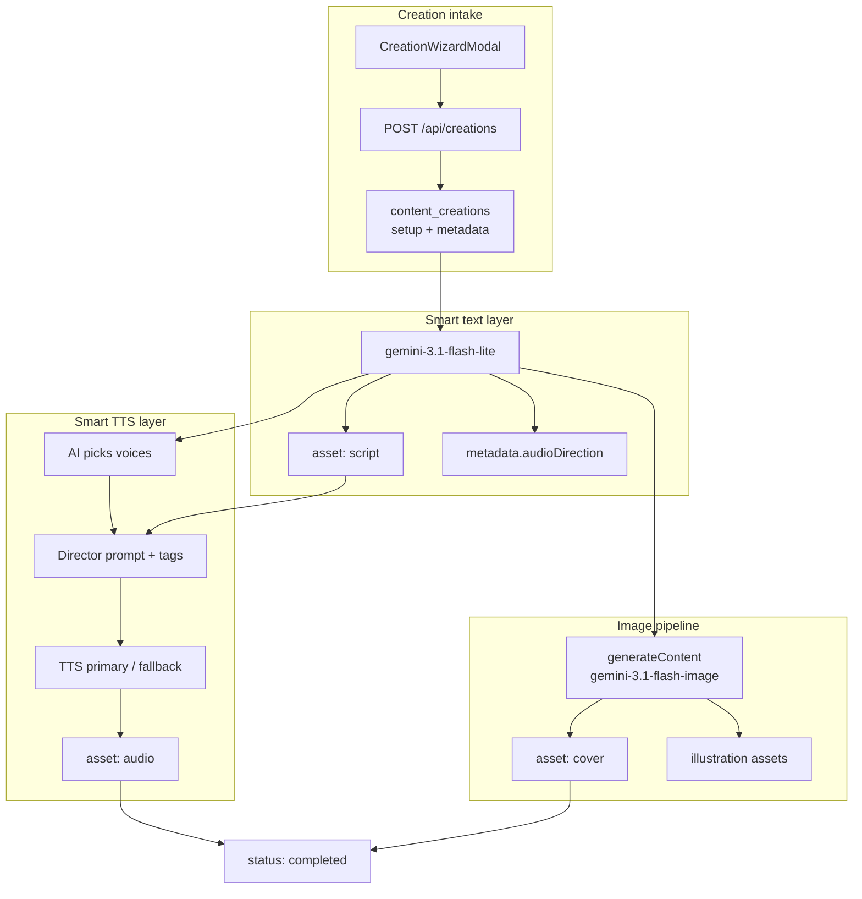

# Chrysty Content Generation Plan

**Single entry point** for implementing AI generation in the Chrysty Creative Library.

Status: **Implemented** — step-based Gemini pipelines run via `POST /api/creations/[id]/generate` (Vercel Pro, `maxDuration=300`, no Trigger.dev).

## Model defaults (locked)

| Role | Model ID | API | Fallback |
|------|----------|-----|----------|
| Text / script / audio direction | `gemini-3.1-flash-lite` | Interactions | — |
| Images (covers, illustrations) | `gemini-3.1-flash-image` | generateContent | — |
| TTS | `gemini-3.1-flash-tts-preview` | Interactions + `response_format: audio` | `gemini-2.5-flash-preview-tts` |

Environment variables:

```bash
GEMINI_API_KEY=                    # server-only, never expose to client
GEMINI_MODEL=gemini-3.1-flash-lite
GEMINI_IMAGE_MODEL=gemini-3.1-flash-image
GEMINI_TTS_MODEL=gemini-3.1-flash-tts-preview
GEMINI_TTS_FALLBACK_MODEL=gemini-2.5-flash-preview-tts
GENERATION_INTERNAL_SECRET=         # step self-chain (server-only)
APP_URL=                            # optional; defaults to VERCEL_URL
```

`GEMINI_STT_MODEL` (speech-to-text) is separate from TTS synthesis.

SDK: `@google/genai` >= 2.3.0

## Architecture



## Current codebase (what exists today)

| Piece | Location | State |
|-------|----------|-------|
| Wizard forms | `src/features/creation/creation-schema.ts` | Story, audiobook, podcast |
| Form → DB payload | `src/lib/content/create-from-input.ts` | Sets `artworkGradient` placeholder |
| Create API | `src/app/api/creations/route.ts` | Inserts `status: generating` |
| Assets upload | `src/lib/content/assets.ts` | `audio`, `cover`, `script`, `source`, `illustration` |
| Card UI | `src/components/home/creation-card.tsx` | CSS gradients; cover URL in metadata (UI wiring deferred) |
| AI execution | `src/lib/ai/` + `POST /api/creations/[id]/generate` | Step-based pipelines; self-chain via `waitUntil` |

After creation, `POST /api/creations` kicks off generation. Each step runs one Gemini call (or compose), updates `progress`/`metadata`, and self-chains until `completed` or `failed`. Client polls every 3s while any creation is `generating`.

## Wizard form → AI inputs

Form data is stored in `content_creations.setup` (jsonb). The text model interprets these fields — they are **hints**, not hard-coded voice/style mappings.

### Story

| Field | Purpose |
|-------|---------|
| `language` | BCP-47 code (e.g. `en`, `fr`, `es`) — target language for generated text, images, and TTS |
| `storyType`, `storyTypeCustom` | Genre (bedtime, fantasy, horror, etc.) |
| `mainIdea` | Core prompt / topic |
| `audience` | `kids`, `teen`, `adult` — drives tone and voice |
| `length`, `lengthCustom` | Page count for script + illustration count |

### Audiobook

| Field | Purpose |
|-------|---------|
| `language` | BCP-47 code — target language for narration script and TTS |
| `audiobookType`, `audiobookTypeCustom` | Content genre |
| `topicIdea` | Main subject |
| `voiceStyle`, `voiceStyleCustom` | `calm`, `dramatic`, `storyteller`, etc. — AI maps to Gemini voice + director's notes |

### Podcast

| Field | Purpose |
|-------|---------|
| `language` | BCP-47 code — target language for episode script and TTS |
| `podcastType`, `podcastTypeCustom` | news, interview, educational, etc. |
| `participants` | `one_host`, `host_guest`, `roundtable` |
| `topicIdea` | Episode subject |
| `newsType`, `subject`, `subjectCustom` | Subtype fields |

## Pipeline by category

### Story (illustrated book)

Stories use the **illustrated book** pipeline: text pages with inline illustration, explanation, or diagram slots. Final output is a [Book Manifest](./content-metadata-schema.md) rendered like a real book.

**Full rules:** [story-generation-rules.md](./story-generation-rules.md)  
**Metadata contract:** [content-metadata-schema.md](./content-metadata-schema.md)

| Phase | What happens |
|-------|----------------|
| 1. Plan | Page outline, illustration slots, character bible |
| 2. Write | Full prose + illustration briefs per slot |
| 3. Cover | Card cover (`asset_type: cover`, `role: card_cover`) |
| 4. Illustrate | In-story images (`asset_type: illustration`) |
| 5. Compose | Book Manifest JSON + creation metadata |

TTS narration for stories is optional future work (see [gemini-text-to-speech.md](./gemini-text-to-speech.md)).

### Audiobook

Audiobooks use the **audio-primary** pipeline: AI plans target duration, picks a narrator voice, writes a tagged script, builds a director prompt, and runs TTS (single speaker).

**Full rules:** [audio-generation-rules.md](./audio-generation-rules.md)  
**Metadata contract:** [content-metadata-schema.md](./content-metadata-schema.md) (Audio Manifest)

| Phase | What happens |
|-------|----------------|
| 1. Audio plan | Target duration (AI-inferred), voice selection, segment outline |
| 2. Script + director | Tagged script for TTS + Audio Profile + Scene + Director's Notes (single LLM call) |
| 3. TTS | Chunked WAV segments (single speaker) |
| 4. Compose | Audio Manifest JSON (playback metadata only, no transcript) + final audio + `duration_minutes` |

### Podcast

Podcasts use the same audio pipeline with multi-speaker TTS when `participants` is `host_guest` or when roundtable/debate content is split into 2-speaker segments.

**Full rules:** [audio-generation-rules.md](./audio-generation-rules.md)  
**Metadata contract:** [content-metadata-schema.md](./content-metadata-schema.md) (Audio Manifest)

| Phase | What happens |
|-------|----------------|
| 1. Audio plan | Duration by `podcastType`, speaker roster, voice picks, TTS mode |
| 2. Script + director | Tagged script for TTS + full brief per speaker (single LLM call) |
| 3. TTS | Single- or multi-speaker chunks (max 2 speakers per call) |
| 4. Compose | Audio Manifest (no transcript) + concatenated master audio |

## Smart TTS (core requirement)

TTS is **directed**, not mechanical read-aloud. For podcast and audiobook specifics (duration ranges, voice hints, multi-speaker/roundtable strategy, audio tags, director template), see [audio-generation-rules.md](./audio-generation-rules.md).

General flow:

1. Read `setup` jsonb
2. **Infer target duration** from `podcastType` / `audiobookType`, `participants`, and `topicIdea` (no wizard duration field)
3. Choose voices from the [30-voice catalog](./gemini-text-to-speech.md)
4. Build Audio Profile + Scene + Director's Notes + tagged script (ephemeral — used for TTS only, not stored in manifest)
5. Call TTS with `speech_config`; chunk long content (~3 min max per call)

### Audio direction JSON (store in `metadata.audioDirection`)

See [content-metadata-schema.md](./content-metadata-schema.md) for full shapes. Summary:

```typescript
interface AudioDirection {
  mode: "single_speaker" | "multi_speaker";
  targetDurationMinutes: number;
  estimatedWordCount?: number;
  language: string;
  speakers: Array<{ name: string; voice: string; role: string; audioProfile?: string }>;
  ttsPrompt: string;
  transcript: string;
  segments?: AudioSegmentPlan[];  // roundtable / long content
}
```

Creation-level summary in `metadata.audio`: `format`, `targetDurationMinutes`, `actualDurationMinutes`, `ttsModel`, `segmentCount`.

### Form hints → typical TTS mode

| Category | Typical mode | Notes |
|----------|--------------|-------|
| Audiobook | Single narrator | Map `voiceStyle` to voice personality |
| Podcast `host_guest` | Multi-speaker (2) | Distinct host/guest voices |
| Podcast `one_host` | Single narrator | News → informative voices (Charon, Rasalgethi) |
| Story `kids` | Single narrator | Youthful/warm (Leda, Achird, Sulafat) |
| Story bedtime | Single + tags | `[whispers]`, calm pacing |

### TTS implementation sketch

```typescript
await ai.interactions.create({
  model: process.env.GEMINI_TTS_MODEL!,
  input: direction.ttsPrompt,
  response_format: { type: "audio" },
  generation_config: {
    speech_config:
      direction.mode === "multi_speaker"
        ? direction.speakers.map((s) => ({ speaker: s.name, voice: s.voice }))
        : [{ voice: direction.speakers[0].voice }],
  },
});
```

**Fallback:** On model-unavailable errors, retry with `GEMINI_TTS_FALLBACK_MODEL`. Set `metadata.ttsModel`. Disable streaming on fallback.

**Long content:** Chunk scripts under ~few minutes per TTS call; concatenate WAV files server-side.

**Creativity rules:**

- Embed `[excitedly]`, `[whispers]`, `[laughs]`, etc. where emotion shifts
- Director's notes must reference the actual generated content
- Align voice choice with transcript tone (API limitation)

## Image use cases

| Use case | Asset type | Metadata role | Config |
|----------|------------|---------------|--------|
| Card cover | `cover` | `card_cover` | `aspectRatio: "3:4"`, `imageSize: "1K"` |
| In-story illustration | `illustration` | `illustration`, `explanation`, `diagram` | Multi-turn chat; `pageNumber`, `slotId` |
| Book Manifest | `script` | `book_manifest` | JSON — reader UI source of truth |
| Audio Manifest | `script` | `audio_manifest` | JSON — podcast/audiobook playback source of truth |

Cover replaces `artworkGradient` on cards when `metadata.display.coverUrl` is available (UI work deferred).

## UI and metadata mapping

| UI surface | Data source |
|------------|-------------|
| Library card image | `metadata.display.coverUrl` or resolve `display.coverAssetId` |
| Card subtitle / excerpt | `metadata.display.excerpt` or `description` |
| Page count badge | `page_count` column or Book Manifest `pageCount` |
| Reading time | `metadata.display.readingTimeMinutes` |
| Story reader | Book Manifest `pages[].blocks` + asset URLs by `assetId` |
| Audio player (podcast/audiobook) | Audio Manifest `segments` + `finalAudioAssetId` or segment URLs |
| Duration badge (audio) | `duration_minutes` column or `metadata.audio.actualDurationMinutes` |
| Progress while generating | `metadata.pipeline.status` + `progress` column |
| Gradient fallback | `artwork_gradient` when no cover URL |

Types and validation: [`src/types/content-metadata.ts`](../../src/types/content-metadata.ts)

## Schema mapping

| Storage | Text | Images | TTS |
|---------|------|--------|-----|
| `content_creations.metadata` | `pipeline.textInteractionId` | `pipeline.imageChatId`, `display.*`, `story.*` | `audio`, `audioDirection`, `pipeline.ttsInteractionId` |
| `content_creation_assets` | `script` (Book Manifest, Audio Manifest, plans) | `cover`, `illustration` | `audio` (.wav) |
| `content_creations` fields | `page_count` | — | `duration_minutes` from audio |

## Status lifecycle

```
generating (progress 0) → progress updates → completed | failed
```

Record activity via existing `content_activity` table ("Started creation", "Generated cover", etc.).

## Implementation layout

```
src/lib/ai/gemini-client.ts
src/lib/ai/text/                  # Interactions + JSON parse
src/lib/ai/audio/                 # TTS, WAV concat
src/lib/ai/image/                 # cover + illustration generateContent
src/lib/ai/prompts/               # story, audiobook, podcast smart prompts
src/lib/ai/orchestrator/          # run-step, waitUntil self-chain
src/lib/ai/pipelines/
  story.ts
  audio.ts                        # shared audiobook + podcast
src/app/api/creations/[id]/generate/route.ts   # maxDuration=300
```

Each generate request runs **one pipeline step** (e.g. one illustration or one TTS segment), persists checkpoint in `metadata.checkpoint`, then schedules the next step.

## Open decisions

- **Magazine mode:** Image-only story format (deferred)
- **TTS streaming:** Stream to client vs generate full WAV then upload
- **UI:** Cover images on cards, story reader, audio playback

## Reference docs

- [gemini-interactions-api.md](./gemini-interactions-api.md)
- [gemini-text-generation.md](./gemini-text-generation.md)
- [gemini-image-generation.md](./gemini-image-generation.md)
- [gemini-text-to-speech.md](./gemini-text-to-speech.md)
- [story-generation-rules.md](./story-generation-rules.md)
- [audio-generation-rules.md](./audio-generation-rules.md)
- [content-metadata-schema.md](./content-metadata-schema.md)
