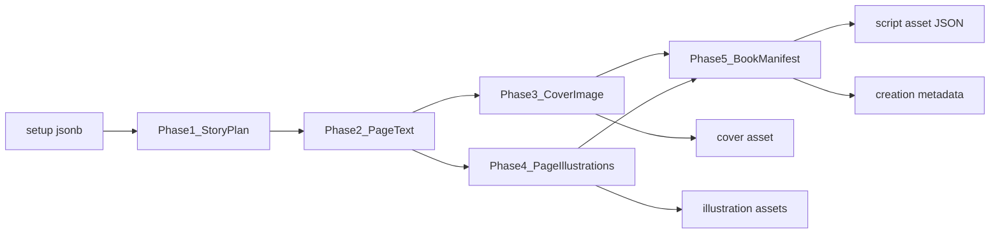

# Story Generation Rules

Rules for AI-generated **illustrated books** in the Chrysty Creative Library (story category only).

Related docs:

- [content-metadata-schema.md](./content-metadata-schema.md) — metadata and Book Manifest
- [content-generation-plan.md](./content-generation-plan.md) — overall pipeline
- [gemini-text-generation.md](./gemini-text-generation.md) — text model
- [gemini-image-generation.md](./gemini-image-generation.md) — cover and illustrations

Default format: **illustrated book** — text pages with inline illustration, explanation, or diagram slots.

## Pipeline overview



The text model plans and writes first. Images are generated **from illustration briefs**, not independently. Phase 5 produces the [Book Manifest](./content-metadata-schema.md) that the reader UI renders.

## Generation phases

| Phase | Model | Output |
|-------|-------|--------|
| 1. Plan | `gemini-3.1-flash-lite` | Story plan: title, page count, per-page summary, illustration slots, character bible, illustration style |
| 2. Write | `gemini-3.1-flash-lite` | Full prose per page; each slot gets a stable ID and `illustrationBrief` |
| 3. Cover | `gemini-3.1-flash-image` | Library card + title-page cover (`3:4`, `1K`) |
| 4. Illustrate | `gemini-3.1-flash-image` | One image per slot; multi-turn chat for character consistency |
| 5. Compose | Server | Book Manifest JSON, asset uploads, `content_creations.metadata` |

Update `metadata.pipeline.status` after each phase: `planning` → `writing` → `illustrating` → `composing` → `completed`.

## Inputs from wizard (`setup` jsonb)

| Field | Rule |
|-------|------|
| `language` | BCP-47 code — all page text, alt text, and narration transcript must be written in this language |
| `storyType`, `storyTypeCustom` | Genre drives tone, slot types, illustration style |
| `mainIdea` | Core narrative seed; must appear in plan |
| `audience` | `kids`, `teen`, `adult` — pacing, vocabulary, visual density |
| `length`, `lengthCustom` | **Exact page count** for manifest (5, 10, 15, or custom 1–15) |

Page count from the wizard is a hard limit. The AI must not exceed it.

## Illustration slot types

| Slot type | Asset `metadata.role` | Use when | Example genres |
|-----------|----------------------|----------|----------------|
| Narrative scene | `illustration` | Emotion, setting, action | fantasy, bedtime, romance, horror |
| Concept explainer | `explanation` | "How it works", cause/effect | educational, sci-fi exposition |
| Visual aid | `diagram` | Labeled or simplified diagram | educational, nonfiction-style |

### Slot placement rules

- **Kids:** at least one visual slot every **3–4 pages** (not every page)
- **Teen / adult:** at least one visual slot every **4–5 pages** (not every page)
- **Page 1 (`title` layout): zero slots** — cover art serves the title page
- **Maximum 1 slot per page** (pages 2+ only)
- **Never illustrate trivial actions** (e.g. "She said hello", "He walked to the door")
- **Prefer slots at major scene changes**, emotional beats, or new concepts
- **Use `text_only` on transition pages** where no key visual moment exists
- **Educational stories:** favor `explanation` or `diagram` where a concept is introduced

Server-side caps (after Phase 1): `ceil(pageCount / 4)` slots for kids, `ceil(pageCount / 5)` for teen/adult. The pipeline trims over-planned slots before illustration runs.

### Illustration brief rules (Phase 2)

Every slot must include an `illustrationBrief` before image generation runs:

- Keep briefs to **1–2 sentences** — enough for image generation, not a second story
- Quote **character names and appearance** from the character bible
- Describe **setting, mood, and moment** from the surrounding text
- Specify **composition** (close-up, wide shot, bird's-eye) when it matters
- The image model must **never guess** story details not in the brief

### Prose rules (Phase 2)

Story prose is the primary output. Do not shorten paragraphs to make room for illustration metadata.

| Audience | Target per page (pages 2+) |
|----------|----------------------------|
| kids | 2–4 paragraphs, ~80–120 words |
| teen | 2–4 paragraphs, ~120–180 words |
| adult | 3–5 paragraphs, ~150–250 words |

Page 1: heading and optional subtitle only — no body paragraphs.

Stable slot IDs: `illus_p{page}_s{index}` (e.g. `illus_p3_s1`).

## Character bible (Phase 1)

Generated once in the planning phase and stored in `content_creations.metadata.story.characterBible`.

Must include:

- Main character(s): name, age, distinctive features, clothing
- Recurring settings
- Overall visual style (e.g. "soft watercolor children's book", "moody ink fantasy")

Reuse in **every** cover and illustration prompt. Pass prior page illustrations as reference images for consistency (see [gemini-image-generation.md](./gemini-image-generation.md)).

## Page layouts

Each page in the Book Manifest uses one layout:

| Layout | Structure | Typical use |
|--------|-----------|-------------|
| `title` | Title, optional subtitle, hero illustration | Page 1 only |
| `text_with_hero` | Heading + paragraphs + one hero image (top or bottom) | Key scene pages |
| `text_with_inline` | Paragraphs with illustration between sections | Most story pages |
| `text_only` | Text blocks only | Use sparingly; transition pages |

Choose layout based on slot count and narrative weight. Page 1 is always `title`.

## Cover rules (library cards)

Covers are **always separate** from in-story illustrations.

| Rule | Detail |
|------|--------|
| Asset type | `cover` |
| Metadata role | `card_cover` |
| Aspect ratio | `3:4`, `imageSize: "1K"` |
| Prompt sources | `mainIdea`, `storyType`, `audience`, character bible |
| Text in image | Avoid readable body text; clean art preferred for card thumbnails |
| Link | `metadata.display.coverAssetId` on the creation row |

The cover represents the story at a glance for [creation cards](../../src/components/home/creation-card.tsx). In-story images use `asset_type: illustration`.

## Text + image cohesion

1. **Plan before write** — slots and briefs are planned in Phase 1, refined in Phase 2
2. **Single image chat session** per creation when possible (`metadata.pipeline.imageChatId`)
3. **Reference chaining** — pass cover or previous illustration as inline reference for character consistency
4. **Graceful degradation** — if an image fails, the page renders text-only; set slot `status: "failed"` in asset metadata and manifest
5. **Compose last** — Book Manifest is assembled only after all assets have IDs and URLs

## Phase outputs (intermediate JSON)

### Story plan (Phase 1 — internal or stored in metadata)

```json
{
  "title": "The Moonlit Garden",
  "pageCount": 10,
  "audience": "kids",
  "illustrationStyle": "Soft watercolor children's book with warm pastels",
  "characterBible": "Luna: 7-year-old girl, curly brown hair, yellow raincoat...",
  "pages": [
    {
      "pageNumber": 1,
      "layout": "title",
      "summary": "Title page introducing Luna and the hidden garden",
      "slots": []
    },
    {
      "pageNumber": 2,
      "layout": "text_with_inline",
      "summary": "Luna hears whispers from the garden gate",
      "slots": [{ "slotId": "illus_p2_s1", "type": "illustration", "briefHint": "Old garden gate covered in ivy, moonlight" }]
    }
  ]
}
```

### Written page (Phase 2 — feeds manifest blocks)

Each page produces `heading` / `paragraph` blocks plus finalized `illustrationBrief` per slot. Do not run Phase 4 until all briefs exist.

## Progress reporting

Map phases to `content_creations.progress`:

| Phase | Progress range |
|-------|------------------|
| Plan + write | 0–50 |
| Cover | 50–60 |
| Illustrate | 60–85 |
| Compose | 85–100 |

## Out of scope (this doc)

- Magazine / image-only story mode (deferred)
- TTS narration for stories (see [gemini-text-to-speech.md](./gemini-text-to-speech.md) — future)
- Story reader UI implementation (consumes Book Manifest — see metadata schema)
