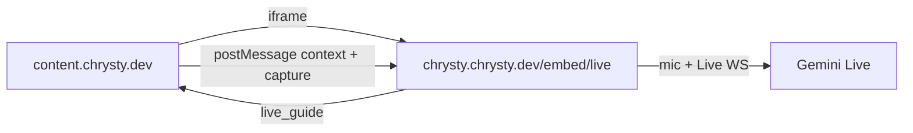

# Ask Chrysty — sibling app implementation guide

**Source of truth:** Astra `docs/embed/ask-chrysty-sibling-apps.md` + `packages/live-embed`.  
**Working pilot:** Learning (`learn.chrysty.dev`). This Content app mirrors that pattern.

Live mic / WebSocket / Gemini run **only** inside `https://chrysty.chrysty.dev/embed/live`.  
The host app only: mounts a FAB, docks an iframe, sends page context + screen capture via postMessage.



---

## Prerequisites

| Requirement | Notes |
|-------------|--------|
| Domain on `*.chrysty.dev` | Shared SSO cookies with Astra |
| User signed in | Same companion profile as Astra |
| `NEXT_PUBLIC_ASTRA_EMBED_URL` | Default `https://chrysty.chrysty.dev` |
| Astra allows iframe | `frame-ancestors` already includes `*.chrysty.dev` on `/embed/*` |
| Package | Vendored `packages/live-embed` (same as `@chrysty/platform`) |

---

## Content integration map

| Piece | File |
|-------|------|
| Provider | [`src/components/providers/app-providers.tsx`](../src/components/providers/app-providers.tsx) — `worker="content"` |
| Shell FAB + default context | [`src/components/layout/content-app-shell.tsx`](../src/components/layout/content-app-shell.tsx) |
| Nested creation context | [`src/features/viewer/consumption/content-viewer-shell.tsx`](../src/features/viewer/consumption/content-viewer-shell.tsx) |
| Package | [`packages/live-embed/`](../packages/live-embed/) |

### Shell (authenticated routes only)

```tsx
<ChrystyHostContext
  source="content_workspace"
  title="Content"
  captureTarget="#workspace-content"
  worker="content"
  entityId={pathname}
>
  <main id="workspace-content" data-chrysty-capture>
    {children}
  </main>
  <AskChrystyButton />
</ChrystyHostContext>
```

### Nested creation viewer (no second FAB)

```tsx
<ChrystyHostContext
  source="content_creation"
  entityId={creation.id}
  title={creation.title}
  captureTarget="#creation-content"
  worker="content"
>
  <div id="creation-content" data-chrysty-capture>
    {/* ContentPane */}
  </div>
</ChrystyHostContext>
```

---

## Env

```bash
NEXT_PUBLIC_ASTRA_EMBED_URL=https://chrysty.chrysty.dev
```

---

## Smoke test

1. Signed-in user on `*.chrysty.dev`
2. FAB visible on every authenticated shell route
3. Open Ask Chrysty → docked panel, not full-screen
4. Allow mic → Connect in iframe → speak / hear
5. Navigate while open → context updates
6. Creation viewer: capture target is `#creation-content`, not chrome
7. Close panel → mic released
8. Side-by-side: full Live on `chrysty.chrysty.dev` still works

**Before prod:** complete the device-gate matrix on real devices (iPhone / iPad / Android / Desktop Chrome / Edge). Desktop Chrome embed grit is an Astra-only open issue — do not ship `mode: 'direct'` as a host workaround.

---

## Anti-patterns

| Don’t | Do |
|-------|-----|
| Multiple providers | One in `AppProviders` |
| FAB on every leaf page | One FAB in `ContentAppShell` |
| Capture + FAB only on detail pages | Shell default + nested upgrades |
| Full-screen host overlay | Package docked panel |
| Remount iframe on every route | Keep open; postMessage updates |
| Host-side mic / Gemini Live | Iframe to Astra only |
| `mode: 'direct'` as mic workaround | Fix Astra `/embed/live` |

The existing text `AssistantPanel` on creation viewer is separate from Ask Chrysty Live — leave it alone unless product decides otherwise.
